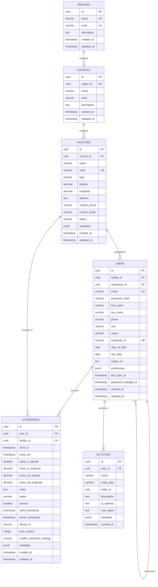

# Database Design

## Entity Relationship Diagram

## Tables

### 1. regions
Top-level geographic divisions (provinces/regions).

**Columns:**
- `id` (UUID, PK) - Unique identifier
- `name` (VARCHAR, UNIQUE) - Region name
- `code` (VARCHAR, UNIQUE) - Short code
- `description` (TEXT) - Region description
- `created_at`, `updated_at` (TIMESTAMP)

**Indexes:**
- `idx_regions_code`, `idx_regions_name`

### 2. councils
Mid-level geographic divisions (districts).

**Columns:**
- `id` (UUID, PK)
- `region_id` (UUID, FK -> regions)
- `name` (VARCHAR) - Council/district name
- `code` (VARCHAR)
- `description` (TEXT)
- `created_at`, `updated_at` (TIMESTAMP)

**Indexes:**
- `idx_councils_region_id`, `idx_councils_code`, `idx_councils_name`

**Constraints:**
- UNIQUE(region_id, name)

### 3. facilities
Health facilities with geolocation.

**Columns:**
- `id` (UUID, PK)
- `council_id` (UUID, FK -> councils)
- `name` (VARCHAR) - Facility name
- `code` (VARCHAR, UNIQUE) - Facility code
- `type` (VARCHAR) - Facility type (Hospital, Health Center, etc.)
- `latitude`, `longitude` (DECIMAL) - Geolocation coordinates
- `address` (TEXT)
- `contact_phone`, `contact_email` (VARCHAR)
- `status` (VARCHAR) - active, inactive, maintenance
- `metadata` (JSONB) - Additional data
- `created_at`, `updated_at` (TIMESTAMP)

**Indexes:**
- `idx_facilities_council_id`, `idx_facilities_code`, `idx_facilities_status`
- `idx_facilities_coordinates`, `idx_facilities_name`

**Constraints:**
- CHECK: Valid coordinates (-90 to 90 for lat, -180 to 180 for lon)
- CHECK: status IN ('active', 'inactive', 'maintenance')

### 4. users
System users with roles and hierarchy.

**Columns:**
- `id` (UUID, PK)
- `facility_id` (UUID, FK -> facilities, nullable)
- `supervisor_id` (UUID, FK -> users, nullable, self-referencing)
- `email` (VARCHAR, UNIQUE)
- `password_hash` (VARCHAR) - bcrypt hash with 12 rounds
- `first_name`, `last_name` (VARCHAR)
- `phone` (VARCHAR)
- `role` (VARCHAR) - User role (see Roles section)
- `status` (VARCHAR) - active, inactive, suspended
- `employee_id` (VARCHAR, UNIQUE)
- `date_of_birth`, `hire_date` (DATE)
- `avatar_url` (TEXT)
- `preferences` (JSONB)
- `last_login_at`, `password_changed_at` (TIMESTAMP)
- `created_at`, `updated_at` (TIMESTAMP)

**Indexes:**
- `idx_users_facility_id`, `idx_users_supervisor_id`, `idx_users_email`
- `idx_users_role`, `idx_users_status`, `idx_users_employee_id`

**Constraints:**
- CHECK: role IN ('tester', 'data_clerk', 'focal', 'ddo', 'supervisor', 'backstopper', 'admin')
- CHECK: status IN ('active', 'inactive', 'suspended')

### 5. attendance
Clock in/out records with offline sync metadata.

**Columns:**
- `id` (UUID, PK)
- `user_id` (UUID, FK -> users)
- `facility_id` (UUID, FK -> facilities)
- `clock_in`, `clock_out` (TIMESTAMP)
- `clock_in_latitude`, `clock_in_longitude` (DECIMAL)
- `clock_out_latitude`, `clock_out_longitude` (DECIMAL)
- `notes` (TEXT)
- `status` (VARCHAR) - clocked_in, clocked_out, incomplete
- `synced` (BOOLEAN) - Sync status
- `client_timestamp` (TIMESTAMP) - Mobile device timestamp
- `server_timestamp` (TIMESTAMP) - Server receipt timestamp
- `device_id` (VARCHAR) - Device identifier
- `sync_version` (INTEGER) - Version for conflict resolution
- `conflict_resolution_strategy` (VARCHAR) - client_wins, server_wins, manual
- `metadata` (JSONB)
- `created_at`, `updated_at` (TIMESTAMP)

**Indexes:**
- `idx_attendance_user_id`, `idx_attendance_facility_id`
- `idx_attendance_clock_in`, `idx_attendance_clock_out`
- `idx_attendance_status`, `idx_attendance_synced`, `idx_attendance_device_id`
- `idx_attendance_user_date`, `idx_attendance_facility_date`

**Constraints:**
- CHECK: clock_out > clock_in
- CHECK: Valid coordinates
- CHECK: status IN ('clocked_in', 'clocked_out', 'incomplete')
- CHECK: conflict_resolution_strategy IN ('client_wins', 'server_wins', 'manual')

### 6. activities
Audit logs and system activities.

**Columns:**
- `id` (UUID, PK)
- `user_id` (UUID, FK -> users, nullable)
- `action` (VARCHAR) - Action performed
- `entity_type` (VARCHAR) - Type of entity affected
- `entity_id` (UUID) - ID of affected entity
- `description` (TEXT)
- `ip_address` (INET)
- `user_agent` (TEXT)
- `metadata` (JSONB)
- `created_at` (TIMESTAMP)

**Indexes:**
- `idx_activities_user_id`, `idx_activities_action`
- `idx_activities_entity_type`, `idx_activities_entity_id`
- `idx_activities_created_at`

## User Roles

| Role | Hierarchy Level | Description |
|------|----------------|-------------|
| tester | 1 | Basic testing access |
| data_clerk | 2 | Data entry and management |
| focal | 3 | Focal point coordinator |
| ddo | 4 | District Development Officer |
| supervisor | 5 | Team supervision |
| backstopper | 6 | Technical support |
| admin | 7 | Full system access |

## Indexing Strategy

### Performance Optimization
1. **Foreign Keys**: All foreign key columns indexed
2. **Lookup Fields**: Frequently queried fields (email, code, status) indexed
3. **Date Ranges**: Clock in/out timestamps indexed for date range queries
4. **Composite Indexes**: user_id + clock_in for user-specific date queries
5. **Geolocation**: Latitude/longitude composite index for proximity searches

### Query Optimization Guidelines
1. Use parameterized queries to prevent SQL injection
2. Leverage indexes for WHERE, JOIN, and ORDER BY clauses
3. Use composite indexes for multi-column filters
4. Avoid SELECT * - specify needed columns
5. Use EXPLAIN ANALYZE for query performance analysis

## Triggers

### Auto-Update Timestamps
Function `update_updated_at_column()` automatically updates `updated_at` on row modification.

Applied to: regions, councils, facilities, users, attendance

## Data Integrity

### Referential Integrity
- CASCADE: regions → councils → facilities
- SET NULL: users.supervisor_id, users.facility_id
- CASCADE: attendance deletes when user deleted

### Check Constraints
- Coordinate validation (-90 to 90, -180 to 180)
- Enum validation for status fields
- Clock out > clock in validation

## Scalability Considerations

1. **Partitioning**: attendance table can be partitioned by date
2. **Read Replicas**: Facilitate with SELECT queries on replicas
3. **Connection Pooling**: 20-100 connections via pgbouncer
4. **Archiving**: Old attendance records can be archived
5. **Indexes**: Regular maintenance (REINDEX) for optimal performance
